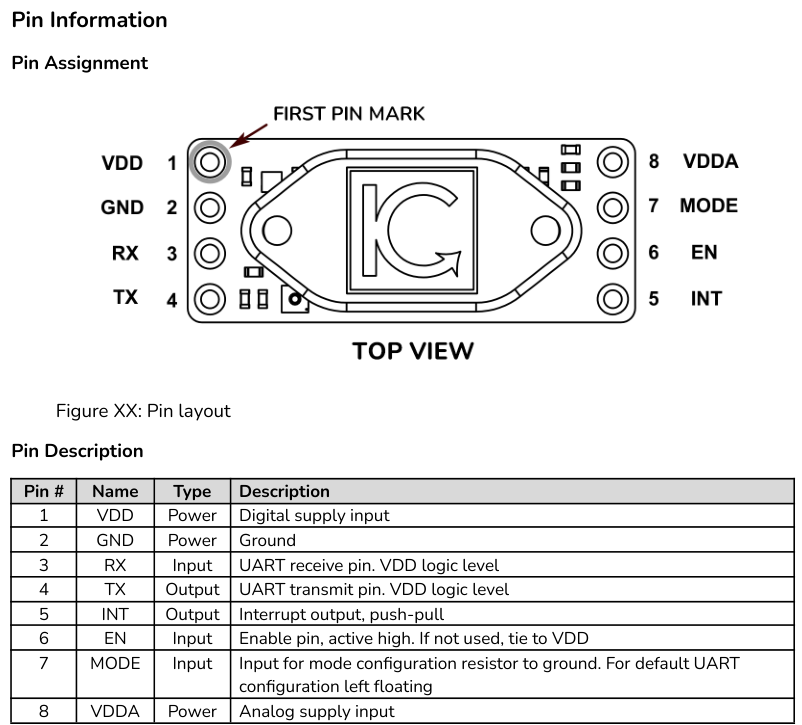

# FaradaIC Sensors FaradayOx Module Protocol

## 1. Hardware Settings



### 1.1 Connection

| Pin | FaradayOx Description | External Master MCU Connection |
|-----|-----------------------|--------------------------------|
| 1   | VCC (Power Supply)    | 3V3 (Main +3.3 V)              |
| 2   | GND (Ground)          | GND                            |
| 3   | TX (UART Transmit)    | MCU UART RX                    |
| 4   | RX (UART Receive)     | MCU UART TX                    |
| 5   | INT (Not Used)        | NC                             |
| 6   | EN (Not Used)         | NC                             |
| 7   | MODE (Not Used)       | NC                             |
| 8   | VDDA (Analog Supply)  | 3V3                            |

### 1.2 UART Settings

**UART** settings: baudarate 115200, 8 data bit, 1 stop bit, parity - none, flow control - none

### 1.3 Protocol

#### 1.3.1 Protocol structure information

All messages to and from the Module are **Framed**.

First byte is **STX**: ```0x02```

Last byte is **ETX**: ```0x0A```

Preceding the **ETX** byte, there are 2 **CRC16** bytes.

The **CRC16** value transmitted in little endian order: first **CRC16_LSB**, than **CRC16_MSB**.

**READY** response: **STX**, **'R'**, **CRC16_LSB**, **CRC16_MSB**, **ETX** - ```0x02 0x52 0x47 0x9B 0x0A```

**ACK** Acknowledge response: **STX**, **'A'**, **CRC16_LSB**, **CRC16_MSB**, **ETX** - ```0x02 0x41 0x15 0xB9 0x0A```

**NACK** Error response: **STX**, **'N'**, **<ERROR_CODE>**, **CRC16_LSB**, **CRC16_MSB**, **ETX** - ```0x02 0x4E <ERROR_CODE> CRC16_LSB CRC16_MSB 0x0A```

#### 1.3.2 Protocol READ Operation

**READ** Operation: ```0xAA```

**READ** request has the following form:

**STX**, **READ_OPERATION**, **ADDRESS_LSB**, **ADDRESS_MSB**, **DATA_LENGTH_LSB**, **DATA_LENGTH_MSB**, **<DATA>**, **CRC16_LSB**, **CRC16_MSB**, **ETX**

Before the **READ** operation it is advisable to perform a **PING** (see [1.5 Wake up](#15-wake-up)) to ensure that the module is not in the Stop mode.

On successfull **READ** operation the module returns following response:
- If it is empty **READ** (read with 0 length): **STX**, **ACK**, **CRC16_LSB**, **CRC16_MSB**, **ETX** - ```0x02 0x41 0x15 0xB9 0x0A```. More on empty read here [1.5 Wake up](#15-wake-up)
- If it is not empty **READ**: **STX**, **ACK**, **ADDRESS_LSB**, **ADDRESS_MSB**, **DATA_LENGTH_LSB**, **DATA_LENGTH_MSB**, **<DATA>**, **CRC16_LSB**, **CRC16_MSB**, **ETX**
- If address is not valid, read length is too big, crc16 is invalid or some other error the **NACK** Error response. 

#### 1.3.3 Protocol WRITE Operation

**WRITE** Operation: ```0x55```

**WRITE** request has the following form:

**STX**, **WRITE_OPERATION**, **ADDRESS_LSB**, **ADDRESS_MSB**, **DATA_LENGTH_LSB**, **DATA_LENGTH_MSB**, **<DATA>**, **CRC16_LSB**, **CRC16_MSB**, **ETX**

Before the **WRITE** operation it is advisable to perform a **PING** (see [1.5 Wake up](#15-wake-up)) to ensure that the module is not in the Stop mode.

On successfull **WRITE** operation module responds with **ACK** response: ```0x02 0x41 0x15 0xB9 0x0A``` (see [1.3.1 Protocol structure information](#131-protocol-structure-information)).
If address is not valid, read length is too big, crc16 is invalid or some other error the **NACK** Error response. 

#### 1.3.4 Protocol possible Error Codes

| Code | Identifier                         | Description                                                                 |
|------|------------------------------------|-----------------------------------------------------------------------------|
| 1    | FRAME_ERROR_NULL_PTR               | NULL pointer passed as argument                                             |
| 2    | FRAME_ERROR_FIRST_NOT_STX          | First byte is not STX                                                       |
| 3    | FRAME_ERROR_LAST_NOT_ETX           | Last byte is not ETX                                                        |
| 4    | FRAME_ERROR_LENGTH_MISMATCH        | Sent length of data bytes is not compatible with the actual data sent       |
| 5    | FRAME_ERROR_INVALID_OPERATION      | Wrong operation                                                             |
| 6    | FRAME_ERROR_INVALID_ADDRESS        | Wrong address                                                               |
| 7    | CONTROL_ERROR_SCRIPT_IN_PROGRESS   | Starting new measurement while another one is already in progress is forbidden |
| 8    | FRAME_ERROR_CRC_MISMATCH           | Wrong CRC                                                                   |

### 1.4 CRC16

CRC16 function used by the module is [CRC-16/CCITT-FALSE](https://reveng.sourceforge.io/crc-catalogue/16.htm) (width=16 poly=0x1021 init=0xffff refin=false refout=false xorout=0x0000)
CRC is computed from body of the frame (**STX** and **ETX** aren't included).

Impementation used in module's firmware:

```C
static const uint16_t crc16_tab[256] = {
    0x0000, 0x1021, 0x2042, 0x3063, 0x4084, 0x50A5, 0x60C6, 0x70E7, 0x8108, 0x9129, 0xA14A, 0xB16B,
    0xC18C, 0xD1AD, 0xE1CE, 0xF1EF, 0x1231, 0x0210, 0x3273, 0x2252, 0x52B5, 0x4294, 0x72F7, 0x62D6,
    0x9339, 0x8318, 0xB37B, 0xA35A, 0xD3BD, 0xC39C, 0xF3FF, 0xE3DE, 0x2462, 0x3443, 0x0420, 0x1401,
    0x64E6, 0x74C7, 0x44A4, 0x5485, 0xA56A, 0xB54B, 0x8528, 0x9509, 0xE5EE, 0xF5CF, 0xC5AC, 0xD58D,
    0x3653, 0x2672, 0x1611, 0x0630, 0x76D7, 0x66F6, 0x5695, 0x46B4, 0xB75B, 0xA77A, 0x9719, 0x8738,
    0xF7DF, 0xE7FE, 0xD79D, 0xC7BC, 0x48C4, 0x58E5, 0x6886, 0x78A7, 0x0840, 0x1861, 0x2802, 0x3823,
    0xC9CC, 0xD9ED, 0xE98E, 0xF9AF, 0x8948, 0x9969, 0xA90A, 0xB92B, 0x5AF5, 0x4AD4, 0x7AB7, 0x6A96,
    0x1A71, 0x0A50, 0x3A33, 0x2A12, 0xDBFD, 0xCBDC, 0xFBBF, 0xEB9E, 0x9B79, 0x8B58, 0xBB3B, 0xAB1A,
    0x6CA6, 0x7C87, 0x4CE4, 0x5CC5, 0x2C22, 0x3C03, 0x0C60, 0x1C41, 0xEDAE, 0xFD8F, 0xCDEC, 0xDDCD,
    0xAD2A, 0xBD0B, 0x8D68, 0x9D49, 0x7E97, 0x6EB6, 0x5ED5, 0x4EF4, 0x3E13, 0x2E32, 0x1E51, 0x0E70,
    0xFF9F, 0xEFBE, 0xDFDD, 0xCFFC, 0xBF1B, 0xAF3A, 0x9F59, 0x8F78, 0x9188, 0x81A9, 0xB1CA, 0xA1EB,
    0xD10C, 0xC12D, 0xF14E, 0xE16F, 0x1080, 0x00A1, 0x30C2, 0x20E3, 0x5004, 0x4025, 0x7046, 0x6067,
    0x83B9, 0x9398, 0xA3FB, 0xB3DA, 0xC33D, 0xD31C, 0xE37F, 0xF35E, 0x02B1, 0x1290, 0x22F3, 0x32D2,
    0x4235, 0x5214, 0x6277, 0x7256, 0xB5EA, 0xA5CB, 0x95A8, 0x8589, 0xF56E, 0xE54F, 0xD52C, 0xC50D,
    0x34E2, 0x24C3, 0x14A0, 0x0481, 0x7466, 0x6447, 0x5424, 0x4405, 0xA7DB, 0xB7FA, 0x8799, 0x97B8,
    0xE75F, 0xF77E, 0xC71D, 0xD73C, 0x26D3, 0x36F2, 0x0691, 0x16B0, 0x6657, 0x7676, 0x4615, 0x5634,
    0xD94C, 0xC96D, 0xF90E, 0xE92F, 0x99C8, 0x89E9, 0xB98A, 0xA9AB, 0x5844, 0x4865, 0x7806, 0x6827,
    0x18C0, 0x08E1, 0x3882, 0x28A3, 0xCB7D, 0xDB5C, 0xEB3F, 0xFB1E, 0x8BF9, 0x9BD8, 0xABBB, 0xBB9A,
    0x4A75, 0x5A54, 0x6A37, 0x7A16, 0x0AF1, 0x1AD0, 0x2AB3, 0x3A92, 0xFD2E, 0xED0F, 0xDD6C, 0xCD4D,
    0xBDAA, 0xAD8B, 0x9DE8, 0x8DC9, 0x7C26, 0x6C07, 0x5C64, 0x4C45, 0x3CA2, 0x2C83, 0x1CE0, 0x0CC1,
    0xEF1F, 0xFF3E, 0xCF5D, 0xDF7C, 0xAF9B, 0xBFBA, 0x8FD9, 0x9FF8, 0x6E17, 0x7E36, 0x4E55, 0x5E74,
    0x2E93, 0x3EB2, 0x0ED1, 0x1EF0};

uint16_t crc16_ccitt_false(const uint8_t* data, size_t len)
{
  uint16_t crc = 0xFFFFU;
  while (len--)
  {
    uint8_t idx = (uint8_t) ((crc >> 8) ^ *data++);
    crc = (uint16_t) ((crc << 8) ^ crc16_tab[idx]);
  }
  return crc;
}
```

### 1.5 Wake up

When module is idle it's configured to go into the power efficient Stop mode.
In the Stop mode module disables the UART peripheral on 3 and 4 pins.
TX UART Pin is Output HIGH in Stop Mode.
RX UART Pin is in waiting for interrupt mode, pulled up HIGH.
To wake Module up it is required to either send the interrupt on the RX UART Pin,
or preferably try to write a message to the module.
When module is in sleep the message will be ignored, but module will wake up and
send READY response.

To wake up the device empty **READ** command can be used:
```0x02 0xAA 0x00 0x00 0x00 0x00 0x50 0xF5 0x0A```

In response to this command the module will respond in two ways:
1. **READY** in the case it was in Stop mode: ```0x02 0x52 0x47 0x9B 0x0A```
2. **ACK** in the case it was already awoken before: ```0x02 0x41 0x15 0xB9 0x0A```

Response should be returned before 10ms.
Both **READY** and **ACK** responses indicate that module is ready for subsequent communication.

It is advisable to send **PING** with empty **READ** before every request,
to make sure that device is not sleeping.

### 1.6 Register Map

| Address | Register Name              |
|---------|----------------------------|
| 0x00    | REG_MAP_VER_LSB            |
| 0x01    | REG_MAP_VER_MSB            |
| 0x02    | REG_FIRMWARE_VER_LSB       |
| 0x03    | REG_FIRMWARE_VER_MSB       |
| 0x04    | REG_CONTROL                |
| 0x05    | REG_RESERVED1              |
| 0x06    | REG_STATUS                 |
| 0x07    | REG_RESERVED2              |
| 0x08    | REG_CONCENTRATION_LLSB     |
| 0x09    | REG_CONCENTRATION_LMSB     |
| 0x0A    | REG_CONCENTRATION_MLSB     |
| 0x0B    | REG_CONCENTRATION_MMSB     |
| 0x0C    | REG_TEMPERATURE_LLSB       |
| 0x0D    | REG_TEMPERATURE_LMSB       |
| 0x0E    | REG_TEMPERATURE_MLSB       |
| 0x0F    | REG_TEMPERATURE_MMSB       |
| 0x10    | REG_HUMIDITY_LLSB          |
| 0x11    | REG_HUMIDITY_LMSB          |
| 0x12    | REG_HUMIDITY_MLSB          |
| 0x13    | REG_HUMIDITY_MMSB          |

Concentration, Temperature and Humidity are C float [IEEE 754 single-precision binary floating-point format (32 bits)](https://en.wikipedia.org/wiki/Single-precision_floating-point_format)


#### Control Register (REG_CONTROL 0x04)

| Bit | Mask  | Name                                   | Description                                                |
|-----|-------|----------------------------------------|------------------------------------------------------------|
| 0   | 0x01  | START_MEASUREMENT                      | Start Oxygen concentration + Temp + Humidity measurement   |
| 1   | 0x02  | START_SHT4X_MEASUREMENT                | Start only Temperature + Humidity (SHT4x) measurement      |

Write a 1 to the desired bit to trigger the corresponding action. Bits are self‑clearing.

#### Status Register (REG_STATUS 0x06)

| Bit | Mask  | Name                           | Description                                                             |
|-----|-------|--------------------------------|-------------------------------------------------------------------------|
| 0   | 0x01  | MEASUREMENT_FINISHED           | Last Oxygen + Temp + Humidity measurement cycle finished                |
| 1   | 0x02  | MEASUREMENT_IN_PROGRESS        | Oxygen + Temp + Humidity measurement currently running                  |
| 2   | 0x04  | SHT4X_ERROR                    | Error detected in SHT4x Temp/Humidity sensor                            |
| 3   | 0x08  | MEASUREMENT_ERROR              | General measurement error (Oxygen path)                                 |
| 4   | 0x10  | SHT4X_MEASUREMENT_FINISHED     | Last Temp + Humidity only (SHT4x) measurement finished                  |

Typical flow:
1. Set START_MEASUREMENT or START_SHT4X_MEASUREMENT.
2. Poll MEASUREMENT_IN_PROGRESS (or SHT4X_MEASUREMENT_FINISHED / MEASUREMENT_FINISHED).
3. Read result registers once finished and no error flags are set.

### 1.6 Measurement Procedure

Two types of measurements are possible:
1. Oxygen Concentration measurement, which also triggers Temperature and Concentration measurement.
2. Temperature and Humidity measurement without triggering Oxygen Concentration measurement.

Oxygen conentration measurement procedure:
1. Perform **PING** operation to Wake up the module [1.5 Wake up](#15-wake-up)
2. Write ```0x01``` **START_MEASUREMENT** to the **REG_CONTROL (0x04)** and receive **ACK**
indicating that measurement has started. 
3. Wait 250ms for the measurement to finish.
4. Perform **PING** operation to Wake up the module [1.5 Wake up](#15-wake-up)
5. Read the register map area: ```0x06 - 0x13``` 16 bytes. From **REG_STATUS** to **REG_HUMIDITY_MMSB**

It is not allowed to start measurement if old measurement is still ongoing.

This will allow to see if the measurement finished successfully by inspecting the **REG_STATUS** register. For successfull measurement bits ```0x01``` **MEASUREMENT_FINISHED** and ```0x10``` **SHT4X_MEASUREMENT_FINISHED** should be set and all the other bits should be 0.

When setting up the module it is possible to run only mesurement of temperature and humidity,
without triggering the measurement:

1. Perform **PING** operation to Wake up the module [1.5 Wake up](#15-wake-up)
2. Write ```0x01``` **START_SHT4X_MEASUREMENT** to the **REG_CONTROL (0x04)** and receive **ACK**
indicating that measurement has started. 
3. Wait 10ms.
4. Read the register map area: ```0x06 - 0x13``` 16 bytes. From **REG_STATUS** to **REG_HUMIDITY_MMSB**

### 1.7 Example impementations

**FaradayOxArduinoExample.zip** - Example implementation for Arduino written in C.
**FaradayOxPythonExample.zip** - Example python script to communicate with the module from the PC. Module should be connected to PC with USB-UART converter.